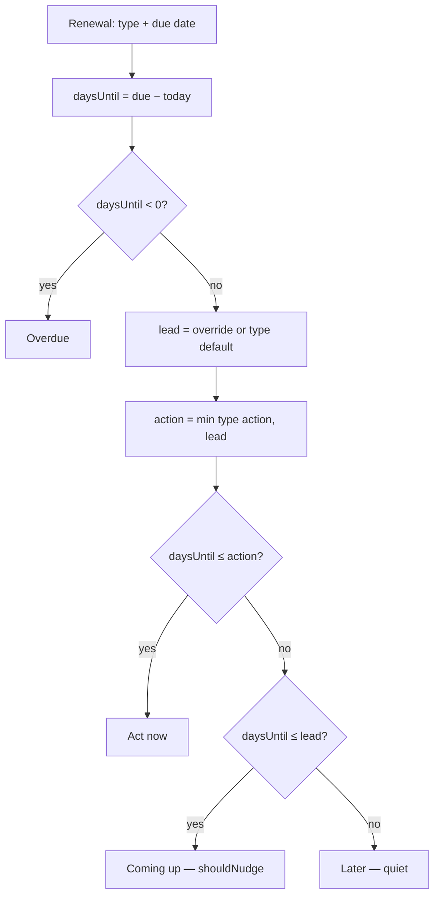
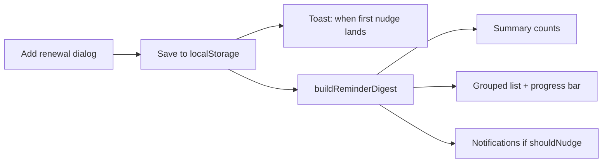

# Renewly — Thinking Document

**Shortcut Asia internship challenge · Topic 02: Renewal Reminder**  
**Repo:** [github.com/jashanantal125/Renewly](https://github.com/jashanantal125/Renewly) · **Stack:** Next.js 16 · TypeScript · Tailwind CSS · localStorage

---

## 1. How I planned and approached it

I treated the brief as a constraint, not a feature list: *~8–12 hours, go deep, be able to explain everything.*

1. **Name the hard problem first.** A reminder is only useful if it lands with enough lead time to act, and without drowning the user in alerts. A flat “remind 7 days before everything” fails passport renewals and over-alerts subscriptions.
2. **Engine before UI.** I wrote pure functions for lead times, urgency, cycle advance, and date math (`src/lib/`), with hand-checked tests, then wrapped a thin UI around them.
3. **Two core features, then only what strengthens them.** Core = add renewals + smart reminder digest. Calendar, summary, and notifications reuse the same engine rather than inventing new rules.
4. **Commit as I went** so the history shows the process (scaffold → engine → UI → calendar → notifications → polish).

I deliberately did **not** build accounts, email/push delivery, or cloud sync. Those need a backend and a scheduler; they don’t prove the nudge logic.

---

## 2. Why these tools

| Choice | Why |
|--------|-----|
| **Next.js + TypeScript** | Fast to ship a hosted web app; types catch date/urgency mistakes early; recommended by the brief. |
| **Tailwind** | Speedy UI without a design-system rabbit hole. |
| **localStorage** | Zero backend for a personal tracker; enough to demo the full workflow. |
| **Pure `src/lib` + Node tests** | Rules are testable without the browser; 36 tests cover edge cases I would pitch. |

Alternatives I rejected: a mobile app (slower to demo/host), a CLI (weaker for “product” review), a backend-first design (overkill for the window).

---

## 3. Main technical decisions

**Type-based lead time + action window.** Each type has a default lead time (when nudging starts) and a shorter action window (when it escalates to “Act now”). Example: road tax lead 30d / action 7d → at 20 days = Coming up; at 5 days = Act now.

**One digest, four buckets.** Overdue → Act now → Coming up → Later. Sorted by urgency, then date. Summary “Due soon” merges Act now + Coming up on purpose (headline question: *how many things need me?*).

**Conditional notification dismiss.** Dismiss stores `{ renewalDate, urgency }`. It stops applying if the item escalates or moves to a new cycle — so dismissing once cannot silence an item until it lapses.

**Calendar projects cycles; urgency does not.** Browsing October shows next month’s Netflix, but urgency always uses the *stored* next due date, never a projected one.

**Save toast names the first nudge.** “Saved” alone is empty; the toast says when the window opens (or that it is already overdue / already nudging).

**Dates in local calendar time.** Helpers parse `YYYY-MM-DD` as local midnight and clamp month-end (31 Jan → 28 Feb) so cycles stay honest.

---

## 4. Key feature flows

### Flow A — Classify urgency (the hard part)



### Flow B — Add renewal → confirm → digest



---

## 5. Architecture & important features

```
UI (page + panels/modals)
  → localStore / localStorage
  → renewals.ts          create / update
  → reminders.ts         urgency, digest, summary, progress, toast copy
  → notifications.ts     which nudges show; acknowledgements
  → calendar.ts          month grid + cycle projection
  → leadTimes.ts + dates.ts + types.ts
```

| Feature | What it shows about the problem |
|---------|----------------------------------|
| **Add / edit / renew** | Cycles with end-of-month clamping |
| **Summary bar** | Instant “what needs me” without scrolling |
| **Urgency list + window progress** | Lead time made visible per card |
| **Notifications** | One nudge per renewal; dismiss ≠ forever silent |
| **Calendar** | Month list + detail; projected cycles labelled |
| **Type marquee** | “Set reminders for → …” (what the app is for) |

---

## 6. Where I used AI — and how I checked it

I used AI as a pair for scaffolding, UI wiring, and drafting copy — **not** as the owner of the domain rules.

| Delegated | Kept / verified |
|-----------|-----------------|
| Next.js layout, Tailwind, panel animations | Lead times, urgency buckets, dismiss rules |
| Form modal / toast / calendar UI structure | Hand-wrote and tested `classifyUrgency`, `isAcknowledged`, cycle projection |
| README / this doc drafts | Every number checked against `leadTimes.ts` and tests |

**Checks:** `npm test` (36 cases, including passport vs subscription, escalation after dismiss, Feb clamp). `npm run build` / lint. Rejected bad ideas (e.g. flat 7-day reminders; dismissing forever; putting lead times on the marquee). Fixed AI/tooling mistakes I found by reading output (unstable `getServerSnapshot` array; invalid `z-60` class; render mutations flagged by ESLint).

---

## 7. Limits & what I’d do next

- In-app only — no email/push until there is a DB + cron (same urgency engine, new transport).
- Per-browser storage; no sync across devices.
- Urgency recalculates on load/render, not while a tab sits open overnight.

**If I shipped tomorrow:** sample data for reviewers, then accounts + scheduled email reusing `shouldNudge`.

**What I chose not to build:** Gmail/OAuth, multi-user backend, dark mode, and feature volume for its own sake. Depth on *when* to nudge mattered more than *how* to deliver email.
