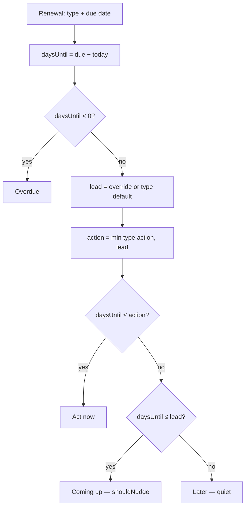
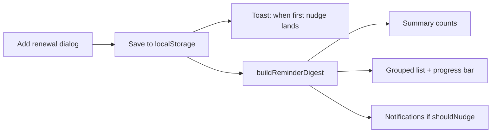
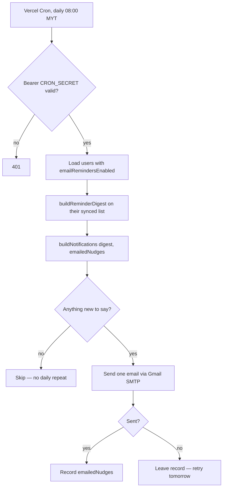

# Renewly — Thinking Document

**Shortcut Asia internship challenge · Topic 02: Renewal Reminder**  
**Repo:** [github.com/jashanantal125/Renewly](https://github.com/jashanantal125/Renewly) · **Stack:** Next.js 16 · TypeScript · Tailwind CSS · localStorage · MongoDB · Gmail SMTP

---

## 1. How I planned and approached it

I treated the brief as a constraint, not a feature list: *~8–12 hours, go deep, be able to explain everything.*

1. **Name the hard problem first.** A reminder is only useful if it lands with enough lead time to act, and without drowning the user in alerts. A flat “remind 7 days before everything” fails passport renewals and over-alerts subscriptions.
2. **Engine before UI.** I wrote pure functions for lead times, urgency, cycle advance, and date math (`src/lib/`), with hand-checked tests, then wrapped a thin UI around them.
3. **Two core features, then only what strengthens them.** Core = add renewals + smart reminder digest. Calendar, summary, and notifications reuse the same engine rather than inventing new rules.
4. **Commit as I went** so the history shows the process (scaffold → engine → UI → calendar → notifications → polish).

I deliberately built the whole nudge engine **before** touching delivery, so the interesting logic was finished and tested while the app was still a single offline page.

**Then I added email delivery — and it changed the honest answer to “does this app work?”** In-app nudges only fire if you open the app, which is the one thing a person about to miss their road tax will not do. So the last step was Google sign-in, a stored copy of the list, and a daily job that emails you. Crucially it reuses the same rules: the job asks the *existing* notification engine what it has not said yet, rather than inventing a second set of timing logic. That is the part I most want to be asked about.

---

## 2. Why these tools

| Choice | Why |
|--------|-----|
| **Next.js + TypeScript** | Fast to ship a hosted web app; types catch date/urgency mistakes early; recommended by the brief. |
| **Tailwind** | Speedy UI without a design-system rabbit hole. |
| **localStorage** | Zero backend for a personal tracker; the app still works fully signed out and offline. |
| **Pure `src/lib` + Node tests** | Rules are testable without the browser; 57 tests cover edge cases I would pitch. |
| **MongoDB** | The reminder job cannot read localStorage, so it needs a server-side copy. A document store fits: one document per user holding their list, with no schema migration work. |
| **Gmail SMTP (nodemailer)** | Needs no verified domain, so reminders reach any inbox during a demo. Isolated behind one `sendEmail()` so swapping to Resend/SES is a one-file change. |
| **Hand-rolled Google OAuth** | ~120 lines I can explain line by line, versus a library I would be guessing about under questioning. See below. |

Alternatives I rejected: a mobile app (slower to demo/host), a CLI (weaker for “product” review), and a backend-first design (the offline app had to prove the logic first).

---

## 3. Main technical decisions

**Type-based lead time + action window.** Each type has a default lead time (when nudging starts) and a shorter action window (when it escalates to “Act now”). Example: road tax lead 30d / action 7d → at 20 days = Coming up; at 5 days = Act now.

**One digest, four buckets.** Overdue → Act now → Coming up → Later. Sorted by urgency, then date. Summary “Due soon” merges Act now + Coming up on purpose (headline question: *how many things need me?*).

**Conditional notification dismiss.** Dismiss stores `{ renewalDate, urgency }`. It stops applying if the item escalates or moves to a new cycle — so dismissing once cannot silence an item until it lapses.

**Calendar projects cycles; urgency does not.** Browsing October shows next month’s Netflix, but urgency always uses the *stored* next due date, never a projected one.

**Save toast names the first nudge.** “Saved” alone is empty; the toast says when the window opens (or that it is already overdue / already nudging).

**Dates in local calendar time.** Helpers parse `YYYY-MM-DD` as local midnight and clamp month-end (31 Jan → 28 Feb) so cycles stay honest.

### Decisions added with email reminders

**Email dedupe reuses the dismissal engine, not new code.** The job runs daily, so the real question is not “what is due” but “what have I not already said”. `buildNotifications` already answers that for the bell: it hides anything outside its lead-time window or already acknowledged, and lets an item back through when it *escalates* or rolls into a new cycle. The job passes an *emailed* record where the UI passes dismissals, and gets one email per renewal per urgency step for free. `planReminderEmails` is 6 lines because of this.

**OAuth by hand instead of a library.** Auth.js would have been fewer decisions, but the brief scores whether I can explain what I ship, and “the library handles it” is not an explanation. The flow is: redirect to Google with a random `state` in a short-lived cookie → verify `state` on the callback → swap the code for an `id_token` server-to-server → read the email out of it. I do not verify the `id_token` signature, deliberately: OpenID Connect permits skipping it when the token comes straight from the token endpoint over TLS, which is a request I made myself, so fetching Google's keys would add moving parts and no safety.

**Sessions are a signed cookie, not a session table.** HMAC-SHA256 over a small JSON payload, compared in constant time. No server state to expire or keep in sync. It is signed but *not* encrypted, so it only carries what the UI already shows on screen.

**The browser stays the source of truth.** Signing in does not migrate the app to the server; it mirrors the list there so the job can read it. One-way push, replace-the-whole-list, debounced. The cost is last-write-wins across devices, which I would not accept in a real product but which keeps the offline app completely unchanged.

**Only record an email after it sends.** The emailed-nudges record is written after a successful send, so a mail outage retries the next day instead of silently marking the reminder as delivered. I tested this by pointing the mailer at bad credentials and confirming the record stayed empty.

**Nothing is offered that cannot work.** With no credentials configured, `/api/me` reports `configured: false` and the sign-in button is not rendered at all, rather than shown and then failing.

---

## 4. Key feature flows

### Flow A — Classify urgency (the hard part)



### Flow B — Add renewal → confirm → digest



### Flow C — Daily email job (reusing the same engine)



The `emailedNudges` record is the same `{ renewalDate, urgency }` shape the bell uses for dismissals, which is what makes step E free.

---

## 5. Architecture & important features

```
Browser (source of truth)
  UI (page + panels/modals)
    → localStore / localStorage
    → renewals.ts        create / update
    → reminders.ts       urgency, digest, summary, progress, toast copy
    → notifications.ts   which nudges show; acknowledgements
    → calendar.ts        month grid + cycle projection
    → leadTimes.ts + dates.ts + types.ts
    → useRenewalSync.ts  one-way mirror to the server when signed in

Server (only needed for email)
  /api/auth/google, /api/auth/callback/google   OAuth, signed session cookie
  /api/me, /api/renewals                        prefs + list mirror
  /api/cron/reminders                            daily job (CRON_SECRET)
    → emailReminders.ts   planReminderEmails — reuses notifications.ts
    → emailTemplate.ts    subject + HTML/text
    → server/mailer.ts    Gmail SMTP
    → server/users.ts     MongoDB: one document per user
```

The engine in `src/lib` is shared: the same `notifications.ts` decides what the bell shows and what the job emails. `src/lib/server/*` is the only code that touches credentials or the database.

| Feature | What it shows about the problem |
|---------|----------------------------------|
| **Add / edit / renew** | Cycles with end-of-month clamping |
| **Summary bar** | Instant “what needs me” without scrolling |
| **Urgency list + window progress** | Lead time made visible per card |
| **Notifications** | One nudge per renewal; dismiss ≠ forever silent |
| **Calendar** | Month list + detail; projected cycles labelled |
| **Type marquee** | “Set reminders for → …” (what the app is for) |
| **Gmail sign-in + daily email** | The nudge escapes the app; dedupe reuses the dismissal rules |

---

## 6. Where I used AI — and how I checked it

I used AI as a pair for scaffolding, UI wiring, and drafting copy — **not** as the owner of the domain rules.

| Delegated | Kept / verified |
|-----------|-----------------|
| Next.js layout, Tailwind, panel animations | Lead times, urgency buckets, dismiss rules |
| Form modal / toast / calendar UI structure | Hand-wrote and tested `classifyUrgency`, `isAcknowledged`, cycle projection |
| OAuth boilerplate, email HTML table markup, the neon CSS | The decision to reuse the notification engine for email dedupe — the idea the feature rests on |
| README / this doc drafts | Every number checked against `leadTimes.ts` and tests |

**Checks:** `npm test` (57 cases, including passport vs subscription, escalation after dismiss, Feb clamp, forged/expired session cookies, malformed sync payloads). `npm run build` / lint.

For the email feature I did not trust “it compiles”. Against a local MongoDB I signed a session cookie myself and drove the real endpoints: synced a list and read it back, posted junk and watched validation reject it, ran the job with mail credentials deliberately wrong and confirmed it reported the failure *and* left the emailed record empty so it would retry. I also drove the signed-in UI in a headless browser to confirm the button disappears once signed in, the list auto-syncs, and the toggle persists. Then I deleted the test user and the local env file.

**Rejected or reworked:** flat 7-day reminders; dismissing forever; lead times on the marquee; a second timing system for email (the whole point was reuse). Mistakes I caught by reading output rather than assuming: an unstable `getServerSnapshot` array, an invalid `z-60` class, render mutations flagged by ESLint, and — during this feature — a silent no-op when a valid cookie outlived its database row, which now recreates the row instead of quietly dropping the write.

---

## 7. Limits & what I’d do next

- **Sync is last-write-wins.** Two devices on one account overwrite each other instead of merging. Fine for one person, wrong for a real product.
- **The job runs once a day in UTC**, and lead times are measured in whole days, so an email can land up to 24h after an item enters its window. Users have no timezone preference yet.
- **Renewals are stored in plain text** in MongoDB. They are low-sensitivity (“Passport, 2 Nov”), but a real product should encrypt at rest and say so.
- **No unsubscribe link in the email** — the toggle is in the app. Real bulk email needs a one-click link.
- **The test-email rate limit is per-instance**, so it is not a real defence across serverless instances.
- Per-browser storage when signed out; urgency recalculates on render, so a tab left open overnight will not reclassify until reloaded.

**If I released tomorrow, first three checks:** that the cron actually fired in production (log per user, not just a 200); that no one gets the same nudge twice or misses one across a month of real days; and that sign-in still works on a fresh Google account with a picture, since I tested the avatar with initials.

**What I chose not to build:** cross-device merging, per-user timezones, dark mode, and feature volume for its own sake. Depth on *when* to nudge still matters more than how many places it appears.
